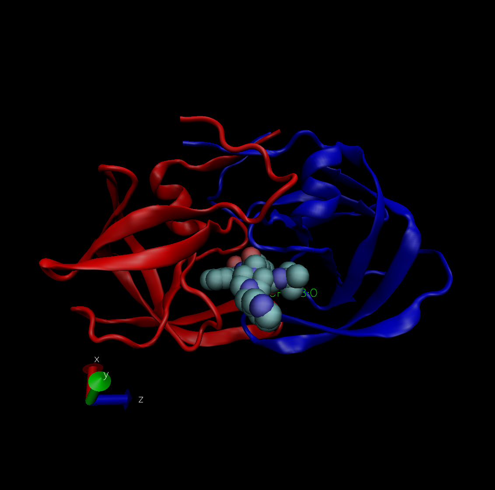

## A quick look at the PDB

```{r}
db <- read.csv("Data Export Summary.csv", row.names=1)
head(db)
```

> Q1: What percentage of structures in the PDB are solved by X-Ray and Electron Microscopy.

```{r}
totalxray <- sum(db$X.ray)
totalem <- sum(db$EM)
total.sums <- sum(db$Total)

perc <- ( (totalxray + totalem)/total.sums ) * 100
perc
```

> Q2: What proportion of structures in the PDB are protein?

```{r}
propProtein <- (160385 / total.sums)
propProtein
```

> Q3: Type HIV in the PDB website search box on the home page and determine how many HIV-1 protease structures are in the current PDB?

There are 591 HIV-protease structures. It is a very important structure.

## Visualizing HIV-1 protease structure using VMD

> Q4: Water molecules normally have 3 atoms. Why do we see just one atom per water molecule in this structure?

We only see the oxygen atoms only because the hydrogen atoms are too small to see.

> Q5: There is a conserved water molecule in the binding site. Can you identify this water molecule? What residue number does this water molecule have (see note below)?

HOH308:0

## VMD Structure visualization image



## Introduction to Bio3D in R

Load bio3d package

```{r}
library(bio3d)
```

Read the pdb file

```{r}
pdb <- read.pdb("1hsg") # accessing the online 1hsg file
pdb
```

To extract the sequence

```{r}
aa123(pdbseq(pdb))
```

Plot of B-factor
```{r}
plot.bio3d(pdb$atom$b, sse=pdb)
```


> Q7: How many amino acid residues are there in this pdb object?

There are 198 amino acid residues.

> Q8: Name one of the two non-protein residues?

A non-protein residue is HOH, or water.

> Q9: How many protein chains are in this structure?

There are 2 protein chains in this structure.

Find the attributes of the object

```{r}
attributes(pdb)
```

Look at ATOM part of the pdb file
```{r}
head(pdb$atom)
```

The atom data in R

```{r}
head(pdb$atom)
```


